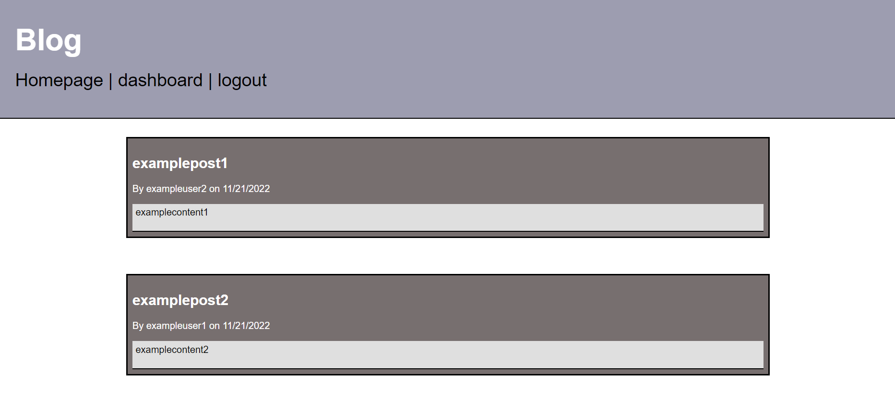

# blog

## Description

This application allows a user to view posts by other users and comment on them and create his own when logged in

## Installation

This application requires node.js and MySQL Server. Open the main folder containing "server.js" of the application in a terminal and enter "npm install".

## Usage

To run this on a local host, open a MySQL shell in the "db" folder and enter "source schema.sql" in order to create the "ecommerce_db" database. This will also drop any existing database with that name. Create a .env file and add your MySQL username and password and the name of the database, as shown below. Open the main folder containing "server.js" in a terminal and enter "npm run seed" to seed the database then enter "npm start". Go to http://localhost:3001/ on a web browser. On the home page, click on a post to see the comments. Sign up or login to create a comment. Click on "Dashboard" to view your previous posts and create new ones.

https://github.com/BrendanShelton/blog
https://intense-brushlands-34800.herokuapp.com/

## Technologies used

HTML, CSS, Javascript, Node.js, MySQL Server, Express, Handlebars, Sequelize

## Credits

N/A

## License

MIT License

Copyright (c) 2022 BrendanShelton

Permission is hereby granted, free of charge, to any person obtaining a copy
of this software and associated documentation files (the "Software"), to deal
in the Software without restriction, including without limitation the rights
to use, copy, modify, merge, publish, distribute, sublicense, and/or sell
copies of the Software, and to permit persons to whom the Software is
furnished to do so, subject to the following conditions:

The above copyright notice and this permission notice shall be included in all
copies or substantial portions of the Software.

THE SOFTWARE IS PROVIDED "AS IS", WITHOUT WARRANTY OF ANY KIND, EXPRESS OR
IMPLIED, INCLUDING BUT NOT LIMITED TO THE WARRANTIES OF MERCHANTABILITY,
FITNESS FOR A PARTICULAR PURPOSE AND NONINFRINGEMENT. IN NO EVENT SHALL THE
AUTHORS OR COPYRIGHT HOLDERS BE LIABLE FOR ANY CLAIM, DAMAGES OR OTHER
LIABILITY, WHETHER IN AN ACTION OF CONTRACT, TORT OR OTHERWISE, ARISING FROM,
OUT OF OR IN CONNECTION WITH THE SOFTWARE OR THE USE OR OTHER DEALINGS IN THE
SOFTWARE.
